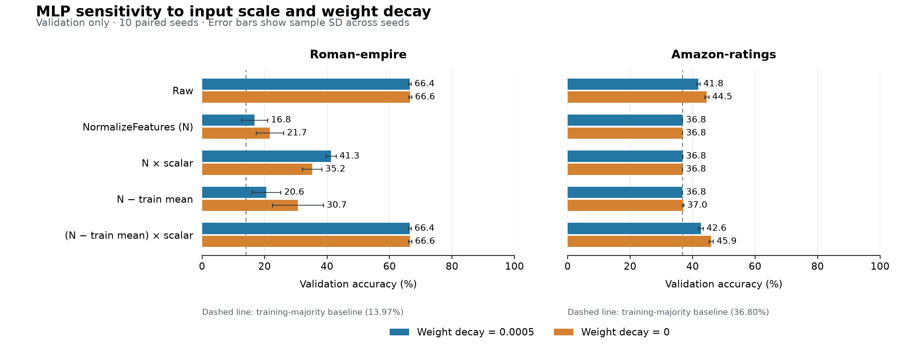

# MLP 优化诊断：第一阶段结果与解释

2026-09-08。本轮是由已有结果引出的事后诊断，仅使用训练集和验证集，不是独立确认实验。

**主要发现：低性能对特征尺度与整体偏移的组合非常敏感。仅关闭权重衰减不能解释或消除这一现象。** 对归一化特征同时进行训练集中心化和单一标量缩放后，Roman-empire 的 MLP 验证准确率恢复到原始特征的水平，Amazon-ratings 也脱离了多数类常量预测。

## 完成范围与完整性

- 原有预处理实验的 280 条记录全部通过校验；重新汇总后，原先的全部科学数值精确重现。
- 新实验包含两个数据集、十个原始种子、五种特征条件和两档权重衰减，共 200 条选中模型记录、800 个训练试验，失败记录为零。
- 保持原来的 MLP、四组学习率/丢弃率组合、500 轮上限、100 轮耐心值和验证选择顺序。新增测试集评估为零。
- 全部原始文件哈希、20 个数据划分、变换后特征哈希、训练集拟合统计、类别数量、训练历史与检查点选择均通过校验。
- 原始特征和 NormalizeFeatures、权重衰减 0.0005 的 40 条对照记录，验证准确率、验证损失及选中试验编号与先前实验完全一致。
- 执行源码在训练前固定于 `3163a5dcb04044c944635fccfb86e7bdd2666c3c`。源码文件指纹与运行清单完全匹配。

## 固定权重衰减下的主要结果

下表均为**验证准确率百分比的均值 ± 种子间样本标准差**，权重衰减固定为 0.0005。标准差不是总体置信区间。

| 特征输入 | Roman-empire | Amazon-ratings |
|---|---:|---:|
| 原始特征 | 66.44 ± 0.46 | 41.84 ± 0.50 |
| NormalizeFeatures，记为 N | 16.75 ± 4.20 | 36.80 ± 0.00 |
| N × 标量 | 41.25 ± 1.61 | 36.80 ± 0.01 |
| N − 训练集列均值 | 20.60 ± 4.57 | 36.80 ± 0.00 |
| (N − 训练集列均值) × 标量 | 66.45 ± 0.44 | 42.65 ± 0.69 |

标量是原始与归一化训练特征的整体中心化 RMS 之比，分别约为 531.16 和 375.91。它是一个全局标量，不是逐特征标准化。N 保留原来的 PyG 变换；新增均值与缩放系数只用训练特征拟合，不使用标签。

## 多数类现象得到了直接核验

Amazon-ratings 的 N 条件在原权重衰减下，十个种子的全部验证样本都被预测为训练集多数类。关闭权重衰减后仍然是十个种子全部如此。单独放大尺度或单独中心化，在原权重衰减下也几乎没有改善；同时中心化与缩放后，十个种子都脱离了常量预测。

Roman-empire 的 N 条件有五个种子在验证集上只预测训练多数类，另五个种子也有明显的类别集中，但不能把十个种子统称为常量预测。仅放大尺度可提高约 24.50 个百分点；在放大后再中心化还可提高约 25.20 个百分点，这两个配对差异在十个种子上均为正。

## 能支持的解释

从 N 到中心化并缩放后的输入，是保留信息的可逆仿射变换（忽略浮点舍入）。带偏置的第一层可以通过改变权重与偏置表示同一个函数。因此，这次恢复不能简单归结为增加了新的标签信息或模型表达能力；它直接支持当前训练过程对输入参数化的敏感性。

尤其在 Amazon-ratings 上，单独放大和单独中心化几乎无效，而组合后有效。把问题概括为“归一化把数值变小了”仍不完整；整体偏移、尺度以及有限训练过程的相互作用需要一起考虑。本实验没有唯一分离出 Adam、激活函数、偏置、有限轮数或隐式正则化的贡献。

权重衰减的影响是有条件的。Amazon-ratings 在中心化并缩放后，关闭权重衰减使验证准确率从 42.65% 提高到 45.93%，但验证交叉熵从约 1.343 增至 1.461，训练准确率也从 51.84% 增至 70.04%。这不是所有评价标准同时改善，不能直接宣布零权重衰减为最佳默认设置。Roman-empire 单独放大后的零权重衰减甚至降低了验证准确率。

## 对研究路线的影响

本轮把“多数类基线附近的准确率”推进成了有预测分布证据、可重复的训练诊断。它增强了预处理与优化设置需要共同检查的理由，但只覆盖两个已选数据集和 MLP，不能据此解释全部图模型、原始完整基准的负结果或测试集泛化表现。原冻结基准及论文文本未因此改写。

下一阶段应在单独固定条件和预算后，对原先接近多数类基线的图模型做同样的输入参数化对照，并保留强图模型作为参照；再决定是否值得扩展到独立数据。这里没有把新的 MLP 验证结果与旧图模型测试结果拼接成新的图—MLP差距。

完整数值、所有预设配对差异和对照重现检查见 [机器可读汇总](../results/diagnostic/posthoc_mlp_optimization_v1/analysis/mlp_optimization_diagnostic_summary.json) 与 [完整结果表](../results/diagnostic/posthoc_mlp_optimization_v1/analysis/mlp_optimization_diagnostic_summary.md)。设计与执行命令见 [实验方案](mlp_optimization_diagnostic_plan.md)。
